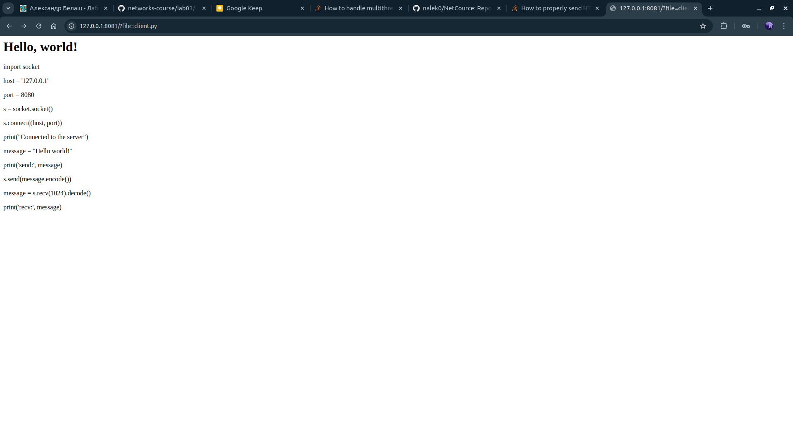
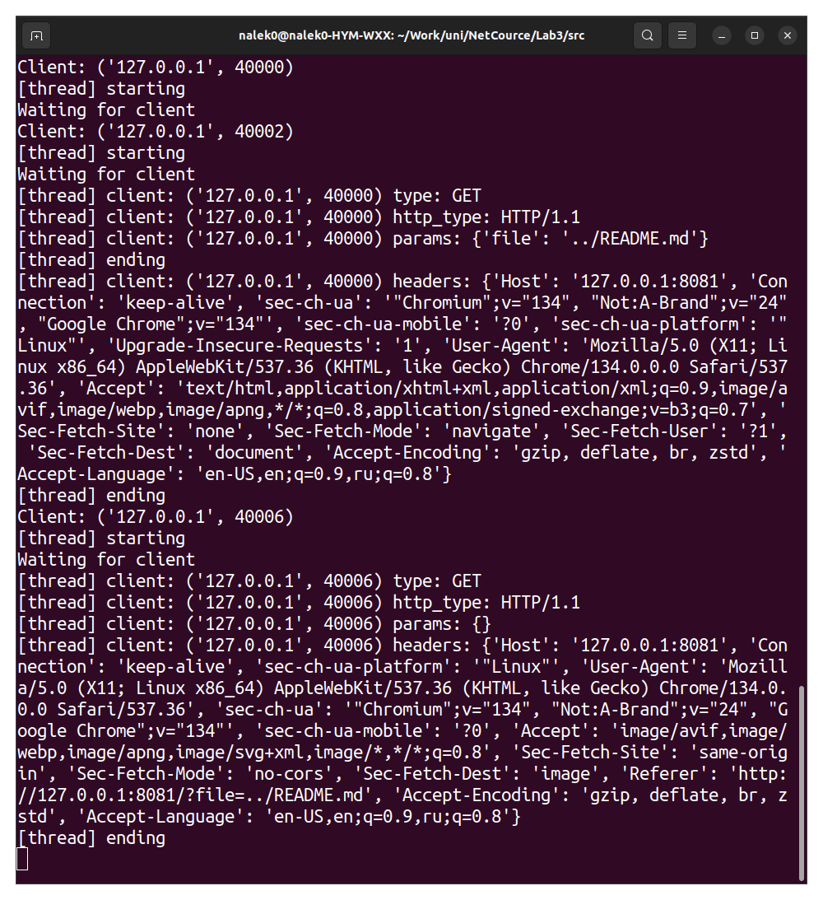

# Практика 3. Прикладной уровень

## Task 1+2

Сервер реализован Python скроптом в файле [script.py](./src/script.py).
Сразу реализовывалась многопоточная версия.

### Работоспособность

Запуск на `8080` поту:

```bash
cd NetCource/Lab3/src/
python3 script.py 8080
```

В таком случае если перейти по ссылке [http://127.0.0.1:8080/?file=client.py](http://127.0.0.1:8080/?file=client.py),
будет возвращен файл [client.py](./src/client.py)

### Скриншоты



